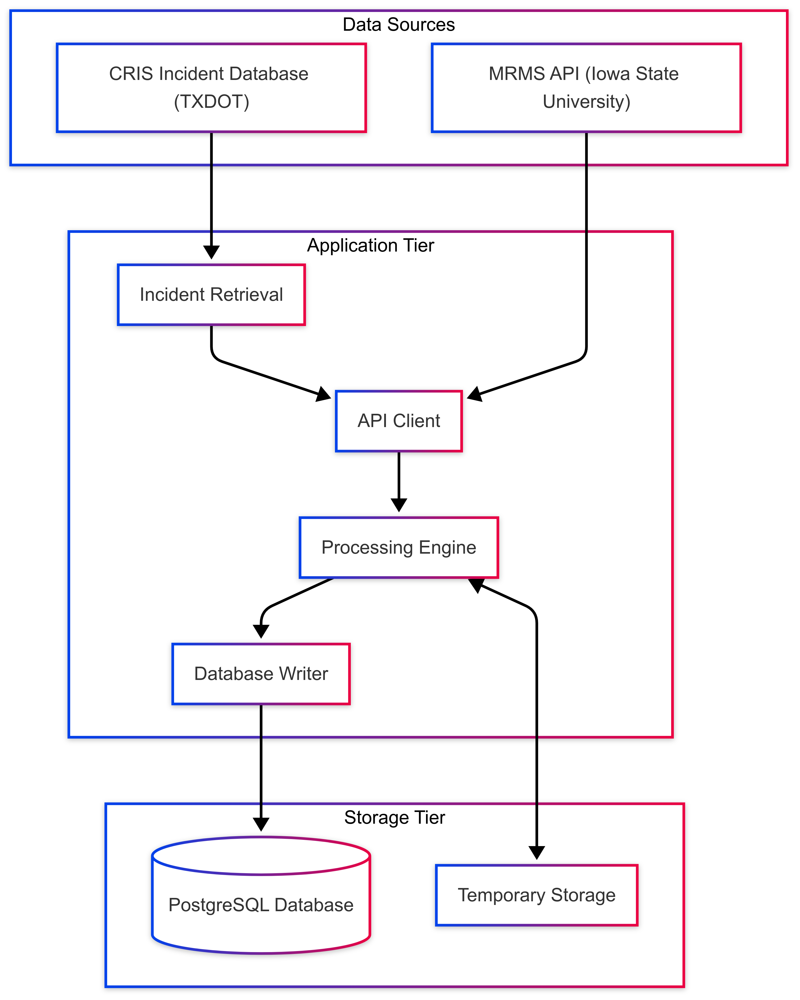
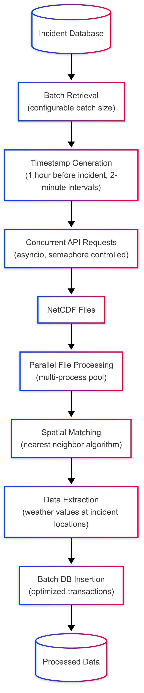
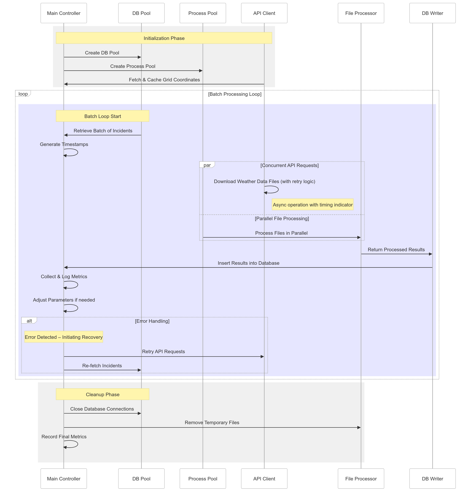

# MRMS-CRIS Records Mapping System: Technical Documentation

## Table of Contents
- [Introduction & Project Overview](#introduction--project-overview)
  - [Purpose](#purpose)
  - [Scope](#scope)
  - [Executive Summary](#executive-summary)
- [1. Data Profile & Source Capabilities](#1-data-profile--source-capabilities)
  - [1.1 Data Characteristics](#11-data-characteristics)
    - [Temporal Attributes](#temporal-attributes)
    - [Spatial Attributes](#spatial-attributes)
    - [Data Format & Storage Needs](#data-format--storage-needs)
    - [NetCDF Data Structure](#netcdf-data-structure)
  - [1.2 MRMS API Source Capabilities](#12-mrms-api-source-capabilities)
    - [API Details](#api-details)
    - [MRMS Data Product Information](#mrms-data-product-information)
    - [Data Availability](#data-availability)
    - [Transformation Requirements](#transformation-requirements)
- [2. CTR's Data Acquisition & Processing Methodology](#2-ctrs-data-acquisition--processing-methodology)
  - [2.1 System Architecture & Technology Stack](#21-system-architecture--technology-stack)
    - [Core Technologies](#core-technologies)
    - [System Components](#system-components)
  - [2.2 Data Acquisition Process](#22-data-acquisition-process)
    - [Data Flow](#data-flow)
    - [API Integration Implementation](#api-integration-implementation)
  - [2.3 Processing Workflow & Component Interaction](#23-processing-workflow--component-interaction)
  - [2.4 Modular System Components](#24-modular-system-components)
    - [Acquisition Module](#acquisition-module)
    - [Processing Module](#processing-module)
    - [Storage Module](#storage-module)
    - [Database Schema](#database-schema)
  - [2.5 Critical Algorithms & Technical Implementation](#25-critical-algorithms--technical-implementation)
    - [Spatial Mapping Algorithms](#spatial-mapping-algorithms)
      - [Nearest Neighbor Search Implementation](#nearest-neighbor-search-implementation)
    - [Time Series Processing](#time-series-processing)
      - [Timestamp Generation](#timestamp-generation)
    - [Database Access Optimization](#database-access-optimization)
    - [Adaptive Batch Processing](#adaptive-batch-processing)
  - [2.6 Performance & Resource Optimization](#26-performance--resource-optimization)
    - [Performance Optimization Techniques](#performance-optimization-techniques)
    - [Data Management Optimizations](#data-management-optimizations)
    - [Processing Performance Metrics](#processing-performance-metrics)
      - [Infrastructure & Resources](#infrastructure--resources)
      - [Processing Metrics](#processing-metrics)
      - [Resource Utilization](#resource-utilization)
      - [Processing Breakdown](#processing-breakdown)
      - [Performance Metrics](#performance-metrics)
  - [2.7 Quality Assurance & Quality Control](#27-quality-assurance--quality-control)
    - [Data Validation Processes](#data-validation-processes)
      - [Incident Data Validation](#incident-data-validation)
      - [Weather Data Validation](#weather-data-validation)
    - [Error Handling & Recovery](#error-handling--recovery)
      - [API Request Handling](#api-request-handling)
      - [Processing Error Handling](#processing-error-handling)
      - [Database Operation Safeguards](#database-operation-safeguards)
    - [Monitoring & Metrics](#monitoring--metrics)
    - [Additional QA/QC Processes](#additional-qaqc-processes)
      - [Completeness Assessment](#completeness-assessment)
  - [2.8 Data Analysis](#28-data-analysis)
    - [2.8.1 Data Aggregation Methods](#281-data-aggregation-methods)
    - [2.8.2 Spatial and Temporal Interpolation](#282-spatial-and-temporal-interpolation)
    - [2.8.3 Variable Estimation](#283-variable-estimation)
- [3. Conclusion](#3-conclusion)
- [4. Contact Information](#4-contact-information)
  - [For Technical Inquiries](#for-technical-inquiries)
  - [For Data Analysis Inquiries](#for-data-analysis-inquiries)

## Introduction & Project Overview

### Scope
The documentation covers the complete workflow from data acquisition to processing and storage. It explains how the system retrieves incident data, acquires corresponding weather data from MRMS sources, processes and maps the data spatially, and stores the results for further analysis. The focus is on system architecture, data flow, and the technical implementation that ensures efficient and reliable operation.

### Executive Summary

**Overview:**
The MRMS-CRIS Records Mapping System efficiently fuses TXDOT traffic incident data (CRIS) with high-resolution MRMS weather data. This process creates derived datasets tailored for detailed traffic safety analysis, extracting key weather metrics at the specific time and location of each incident using an automated, scalable workflow built on Python and PostgreSQL.

**Key Recommendations & Considerations:**

- **Focus on Derived Datasets:** The research team has developed robust workflows and code to generate analysis-ready datasets (e.g., CRIS incidents paired with relevant weather variables, or Roadway Inventory segments with weather summaries). This approach offers flexibility for various analytical needs while ensuring data usability.

- **Practicality of Data Handling:** Based on the research team's prototyping, archiving and hosting the entirety of raw weather data (whether grid or station-based) presents significant challenges in terms of storage requirements and processing demands, with much of the raw data likely remaining unused. The system focuses on prototypng the most practical workflows by processing raw data into targeted, valuable datasets.

- **Recommended Processing Strategy:** For ongoing data needs, it is recommended to implement periodic processing (e.g., daily, weekly, or monthly) to generate and update the derived datasets. For establishing a baseline historical dataset (covering, for instance, the past 1-5 years), a bulk processing run can be performed.

- **Proposed Initial Data Products:** It is suggested to begin with the derived variables proposed for CRIS incidents, which include all relevant 2-minute grid data points and 5-minute station data points for the hour preceding each incident. For roadway segment analysis, starting with approximately five key weather variables aggregated monthly provides a solid foundation. These datasets can be expanded based on evolving user requirements.

- **Performance & Resources:**
  - **Processing Time:** On TACC's high-performance computing resources, the system processed a full year of data (~600,000 incidents) in approximately two days. For standard server environments, based on the projection that one year of data would take approximately one month to process, the following *rough* estimates can be derived (further testing can refine these):
      - **1 Month:** ~2.5 days 
      - **1 Week:** ~15 hours 
      - **1 Day:** ~2 hours 
  - **HPC Utilization:** The system's efficiency on TACC is achieved through techniques like asynchronous I/O for network/database operations, parallel processing across numerous workers, and optimized numerical calculations using libraries like NumPy. Further technical details on this implementation can be provided.

- **Future Flexibility & Interface Options:** Should users require dynamic, on-demand access to a broader range of weather parameters beyond the initial derived datasets, developing an interface that queries external data provider APIs directly is a viable option. CTR could prototype such a solution, potentially for deployment within environments like Snowflake. This approach would grant enhanced flexibility without necessitating the hosting of extensive raw weather data archives.

**Conclusion:**
This advanced, flexible system delivers actionable weather insights correlated with traffic incidents efficiently, paving the way for smarter, data-driven transportation safety decisions across Texas.

## 1. Data Profile & Source Capabilities
> *This section addresses TxDOT's request for "the inherent profile and attributes summary of the data and source capabilities"*

### 1.1 Data Characteristics

#### Temporal Attributes
- **Resolution**: 2-minute intervals (MRMS data)
- **Time zones**: UTC standardization with local time zone conversion capabilities
- **Coverage**: Historical weather data for incident analysis
- **Timeframes**: The system processes 1 hour of weather data before each traffic incident

#### Spatial Attributes
- **Geographic coverage**: Statewide coverage across Texas
- **Spatial metadata**: Utilizes latitude and longitude coordinate mapping with grid-based weather data

#### Data Format & Storage Needs
- **File formats**: NetCDF files (.nc) for weather data, PostgreSQL database for incident and processed data
- **Storage requirements**: 
  - Raw data temporarily stored as NetCDF files during processing
  - Processed data stored in PostgreSQL database with spatial indexing
  - Schema designed for efficient querying of weather conditions at incident locations
  - **File Size Note**: Testing indicates individual MRMS NetCDF files (`mrms_a2m` product) average range of **2.0 MB to 2.5 MB** in size. Based on that **100 hours of data (3000 files) would require approximately 6.0 to 7.5 GB** of temporary storage during processing.

#### NetCDF Data Structure
The raw weather data is delivered via the API as NetCDF files (`.nc`), adhering to the `CF-1.6` conventions. Each file represents a specific timestamp and contains the following structure:
- **Dimensions**:
  - `lat`: 3500 points
  - `lon`: 7000 points
- **Coordinates**:
  - `lat (lat)`: A 1D array (shape: 3500) of latitude values (float32). Range: approx. 20.0 to 55.0 degrees North.
  - `lon (lon)`: A 1D array (shape: 7000) of longitude values (float32). Range: approx. -130.0 to -60.0 degrees East.
- **Data Variables**:
  - `mrms_a2m (lat, lon)`: A 2D array (shape: 3500x7000) containing the weather data (float64). For the `mrms_a2m` product, this represents the accumulated precipitation over a 2-minute interval, measured in millimeters (mm).
- **Geographic Coverage**: The coordinate grid covers a significant portion of North America, including the entire state of Texas. The system extracts data relevant to specific Texas incident locations from this larger grid.

### 1.2 MRMS API Source Capabilities

#### API Details
- **Endpoints**: Iowa State University's Mesonet API
  - Primary endpoint: `https://mesonet.agron.iastate.edu/cgi-bin/request/raster2netcdf.py`
  - API Documentation: [Iowa State University Mesonet MRMS A2M Details](https://mesonet.agron.iastate.edu/GIS/rasters.php?rid=3)
- **Query parameters**:
  - `dstr`: Date string in format YYYYMMDDHHMM
  - `prod`: Product code (e.g., 'mrms_a2m' for MRMS accumulated 2-minute precipitation)

#### MRMS Data Product Information
The MRMS A2M product used in this system represents the NCEP MRMS 2-minute interval precipitation accumulation measured in millimeters (mm). According to the Iowa State University Mesonet documentation:

- The data is available in both PNG (8-bit) and netCDF formats
- For direct file access, the URL pattern is: `https://mesonet.agron.iastate.edu/archive/data/%Y/%m/%d/GIS/mrms/a2m_%Y%m%d%H%M.png`
- For netCDF conversion (used in this system): `https://mesonet.agron.iastate.edu/cgi-bin/request/raster2netcdf.py?dstr=%Y%m%d%H%M&prod=mrms_a2m`
- The precipitation values range from 0 to 5.08+ mm per 2-minute interval
- The data uses a color-coded index for visualization with 256 value slots (when in PNG format)

#### Data Availability
- **Data download process**: Asynchronous HTTP requests with retry mechanisms
- **Data size**: NetCDF files containing gridded weather data covering Texas
- **Granularity**: 2-minute intervals with spatial grid resolution determined by MRMS dataset
- **Rate limit handling**: API enforces rate limits requiring throttling strategies
- **Query construction**: Timestamps must be rounded to even minutes to align with MRMS data intervals
- **Source reliability**: API availability is high but occasionally experiences throttling under heavy load

#### Transformation Requirements
- **Conversions**: Grid coordinate mapping to incident locations using nearest-neighbor algorithm
- **Data validation**: NetCDF file integrity checking required
- **Processing**: Extraction of relevant weather metrics at specific incident locations

## 2. CTR's Data Acquisition & Processing Methodology
> *This section addresses TxDOT's request for "what CTR did (and how/tech etc) in order to process"*

### 2.1 System Architecture & Technology Stack

#### Core Technologies
- **Programming Language**: Python 3
- **Database**: PostgreSQL
- **Key Libraries**:
  - asyncio: For concurrent API requests
  - aiohttp: For asynchronous HTTP client
  - xarray: For NetCDF file processing
  - asyncpg/psycopg2: For database operations
  - pytz: For timezone handling

#### System Components

The architecture consists of three tiers:

1. **Data Source Tier**
   - CRIS Incident Database (TXDOT): Provides traffic incident records
   - MRMS API (Iowa State University): Provides weather data

2. **Application Tier**
   - Incident Retrieval: Fetches incident data in configurable batch sizes
   - API Client: Manages requests to the MRMS API with rate limiting and error handling
   - Processing Engine: Processes weather data and maps it to incident locations
   - Database Writer: Handles efficient storage of processed data

3. **Storage Tier**
   - PostgreSQL Database: Permanent storage for processed incident-weather data
   - Temporary Storage: Holds downloaded files during processing

### 2.2 Data Acquisition Process

#### Data Flow

The system processes data through the following sequence:

1. Incident records are retrieved in batches from the database
2. For each incident, the system generates timestamps for the hour preceding it
3. Weather data files are requested from the API for each unique timestamp
4. Downloaded files are validated and processed in parallel
5. For each incident-timestamp pair, the nearest grid point is found
6. Weather values are extracted and stored with incident details
7. Results are batch inserted into the database

#### API Integration Implementation
The system implements an efficient API client with sophisticated error handling that:

1. Manages concurrent API requests using asyncio and semaphores
2. Implements exponential backoff for rate-limited or failed requests
3. Validates downloaded files before further processing
4. Tracks and adapts to changing API response patterns
5. Maximizes throughput while respecting API provider constraints

### 2.3 Processing Workflow & Component Interaction

The process flow consists of three main phases:

1. **Initialize**
   - Create connection pools
   - Set up processing workers
   - Cache grid coordinates

2. **Batch Processing Loop**
   - Retrieve batch of incidents
   - Generate required timestamps
   - Download weather data files
   - Process files in parallel
   - Insert results into database
   - Collect and log metrics
   - Adjust parameters if needed

3. **Cleanup**
   - Close database connections
   - Remove temporary files
   - Record final metrics

### 2.4 Modular System Components

#### Acquisition Module
- **Timestamp Generation**: Creates a sequence of timestamps before each incident
- **Concurrent Downloads**: Managed by semaphore to control API load
- **Rate Limiting**: Tracks and adapts to API throttling errors

#### Processing Module
- **Grid Mapping**: Maps incident coordinates to nearest weather grid points
- **Data Extraction**: Extracts weather values from NetCDF files
- **Vectorized Operations**: Uses numpy for efficient spatial calculations

#### Storage Module
- **Batch Insertion**: Groups records for efficient database insertion
- **Transaction Management**: Uses async transactions for reliability
- **Error Handling**: Robust error handling for database operations

#### Database Schema
The processed data is stored in PostgreSQL using the following structure:

| Column Name | Data Type | Description |
|-------------|-----------|-------------|
| incident_id | Integer | CRIS incident identifier (part of primary key) |
| incident_timestamp | Text | Date and time when the incident occurred |
| incident_lat | Decimal | Latitude coordinate of the incident location |
| incident_lon | Decimal | Longitude coordinate of the incident location |
| mrms2_lat | Decimal | Latitude of the nearest MRMS grid point |
| mrms2_lon | Decimal | Longitude of the nearest MRMS grid point |
| data_value | Decimal | Weather value at the grid point (precipitation amount) |
| mrms_timestamp | Text | Date and time of the weather measurement (part of primary key) |
| data_source | Text | Weather data source identifier |
| api_description | Text | Description of the weather measurement |
| api_unit | Text | Unit of measurement for the weather value |

The system uses a composite primary key of incident ID and weather timestamp to uniquely identify each record, allowing efficient retrieval of weather conditions for specific incidents.

### 2.5 Critical Algorithms & Technical Implementation

#### Spatial Mapping Algorithms

##### Nearest Neighbor Search Implementation
The system utilizes a highly efficient vectorized algorithm based on NumPy for determining the nearest MRMS grid point to each incident location. This approach leverages NumPy's optimized array operations and a binary search strategy:

1.  **Requires Sorted Grids**: Assumes the latitude and longitude grids provided by the MRMS data are sorted, which is typical for such datasets.
2.  **Binary Search**: Uses `numpy.searchsorted` to efficiently find the potential insertion index for each incident coordinate within the sorted grid arrays (latitude and longitude separately). This quickly narrows down the search space with logarithmic complexity (O(log m), where m is the grid size).
3.  **Neighbor Comparison**: Compares the incident coordinate's distance to the grid points immediately to the left and right of the index found by `searchsorted`.
4.  **Vectorization**: All comparisons and selections are performed using vectorized NumPy operations, avoiding explicit Python loops and achieving high performance by utilizing underlying C/Fortran implementations.
5.  **Efficiency**: This combination of binary search and vectorization provides a highly efficient method for processing large batches of incidents against the MRMS grid.

#### Time Series Processing

##### Timestamp Generation
The system generates precise timestamps for MRMS data retrieval using algorithms that:

1. Round incident timestamps to align with 2-minute MRMS data intervals
2. Create sequences of timestamps covering the hour before each incident
3. Handle timezone conversions between local incident time and UTC API time
4. Deduplicate timestamps across multiple incidents to minimize API requests
5. Ensure boundary conditions are properly handled at day/hour transitions

#### Database Access Optimization

The system implements efficient database connection management that:

1. Maintains pools of both synchronous and asynchronous database connections
2. Reuses connections to minimize connection establishment overhead
3. Handles connection errors with appropriate retry mechanisms
4. Ensures proper connection cleanup to prevent resource leaks
5. Scales connection pool size based on workload requirements

#### Adaptive Batch Processing

The system utilizes a sophisticated adaptive batch processing algorithm that dynamically adjusts processing parameters based on real-time performance metrics:

1. **Dynamic Parameter Adjustment**: Automatically reduces batch size and concurrent downloads by 15% when API throttling is detected, then gradually restores to optimal values after successful processing.

2. **Exponential Backoff Strategy**: Implements a progressive backoff mechanism that increases wait time with each throttling event, allowing the API service to recover.

3. **Self-Healing System**: After three consecutive successful batches, the system attempts to restore original processing parameters, maximizing throughput while maintaining stability.

4. **Error-Based Adaptation**: Monitors specific error conditions like rate limiting and connectivity issues to make intelligent adjustments to processing parameters.

5. **Batch Retry Logic**: Automatically retries failed batches with adjusted parameters rather than skipping records, ensuring data completeness.

### 2.6 Performance & Resource Optimization

#### Performance Optimization Techniques

- **Asynchronous I/O**: Maximizes throughput for network and database operations
- **Parallel Processing**: Utilizes multiple CPU cores for file processing
- **Vectorized Operations**: Optimizes spatial calculations using numpy
- **Connection Pooling**: Reduces database connection overhead
- **Grid Coordinate Caching**: Prevents redundant file parsing
- **Adaptive Concurrency**: System adjusts to available resources
- **Batch Size Tuning**: Optimizes memory usage and database efficiency
- **Backoff Strategies**: Handles API rate limiting gracefully
- **Resource Monitoring**: Tracks system performance for optimization

#### Data Management Optimizations

- **Temporary File Cleanup**: Automatic cleanup of temporary NetCDF files
- **Memory Management**: Explicit garbage collection to free memory after each processing batch
- **Data Deduplication**: Weather data files are only downloaded once per unique timestamp
- **Grid Coordinate Caching**: Coordinate information extracted once and reused
- **Adaptive Parameter Management**: Dynamic adjustment of batch size and concurrency

#### Processing Performance Metrics

The MRMS-CRIS Records Mapping System was deployed on the Texas Advanced Computing Center (TACC) Lonestar6 supercomputing environment to process a full year of weather data for approximately 600,000 unique CRIS incidents.

##### Infrastructure & Resources
- **Computing Environment**: TACC Lonestar6 supercomputing cluster
- **Computational Resources**: High-performance computing nodes with optimized I/O
- **Database**: High-throughput PostgreSQL instance

##### Processing Metrics
- **Average Processing Speed**: ~5,000 incidents per minute at peak performance
- **Total Records Processed**: ~600,000 CRIS incidents
- **Total Weather Data Points**: ~18 million individual weather data points (30-32 per incident)
- **Total Processing Duration**: Approximately 2 days for the complete dataset

##### Resource Utilization
- **CPU Usage**: Optimized through parallel processing (125 workers)
- **Memory Usage**: Averaged 33-34% of available memory
- **Disk Usage**: Maintained at approximately 34% of capacity
- **Network Bandwidth**: Managed through adaptive concurrent downloads

##### Processing Breakdown
- **Database Retrieval**: ~2% of processing time
- **API Data Download**: ~65% of processing time (rate-limited by data source)
- **Data Processing**: ~32% of processing time
- **Database Insertion**: ~1% of processing time

##### Performance Metrics
- **Performance Metrics**: System collects detailed metrics on processing times, success rates, and resource utilization
- **Adaptive Performance Tuning**: These metrics inform automatic adjustment of processing parameters

### 2.7 Quality Assurance & Quality Control

#### Data Validation Processes

##### Incident Data Validation
- **Location Filtering**: Incidents with NULL latitude or longitude values are automatically filtered out
- **Coordinate Type Validation**: Latitude and longitude values are validated through conversion to float
- **Timestamp Validation**: Incidents with missing timestamps are skipped from processing
- **Timezone Verification**: All timestamp parsing includes verification that timezone information is present and valid

##### Weather Data Validation
- **NetCDF Integrity Verification**: Each downloaded file undergoes validation to confirm it contains proper NetCDF data
- **HTML Error Detection**: System detects when an error page (HTML) is returned instead of NetCDF data
- **Invalid File Handling**: Files flagged as invalid are tracked but still processed to maintain data continuity
- **Comprehensive Error Capturing**: All file opening errors are logged with detailed information

#### Error Handling & Recovery

##### API Request Handling
- **HTTP Status Monitoring**: All API responses are checked for appropriate HTTP status codes
- **Rate Limit Management**: Specialized handling for 429 (Rate Limit) errors with automatic retries
- **Timeout Prevention**: Configured timeouts prevent requests from hanging indefinitely
- **Response Logging**: Unsuccessful HTTP status codes are logged with details for troubleshooting

##### Processing Error Handling
- **Worker Process Protection**: Error handling is implemented within worker processes to handle exceptions
- **Graceful Degradation**: When processing encounters invalid files, output rows are still generated with NULL for weather data fields
- **Exception Isolation**: Processing errors in one file or incident do not affect others in the batch

##### Database Operation Safeguards
- **Idempotent Operations**: Database insertion uses conflict resolution to prevent duplicates if processing is restarted
- **Transaction Management**: Database operations use proper transaction handling to ensure data integrity
- **Error Recovery**: Exceptions during database operations are caught and logged without terminating the entire process

#### Monitoring & Metrics

- **Detailed Progress Tracking**: Logging captures progress, warnings, and errors throughout execution
- **Error Type Quantification**: Specific counts for API throttling errors and invalid NetCDF files are tracked per batch
- **Performance Metrics**: System collects detailed metrics on processing times, success rates, and resource utilization
- **Adaptive Performance Tuning**: These metrics inform automatic adjustment of processing parameters

#### Additional QA/QC Processes

##### Completeness Assessment
To assess data completeness for the IEM MRMS dataset, the research team focused on evaluating the presence of weather variable records for a one-hour period preceding each crash incident. Given that the dataset provides weather measurements at a 2-minute granularity, approximately 30 data points per incident were expected.
A basic validation process was implemented to check whether each incident had the full set of expected data. Specifically, it was verified:
- That the time range of weather data (start and end timestamps) aligns precisely with the crash timestamp, covering the 1-hour window prior to the incident.
- That each crash incident was associated with close to 30 data records. A completeness threshold of 29 out of 30 data points was used, and the majority of incidents met or exceeded this requirement.
- No imputation techniques were applied, as the dataset did not exhibit significant gaps. Incidents with fewer than 29 data points were flagged for further review but were minimal.
- Provide completeness metrics for the final dataset.

## 2.8 Data Analysis

This section details the data analysis methodologies applied to the processed weather and incident data, as well as how the data is analyzed to derive meaningful insights and variables.

#### 2.8.1 Data Aggregation Methods

The IEM MRMS dataset provides precipitation values at a 2-minute resolution. Temporal aggregation was performed by summing the values across the 1-hour period preceding each crash incident. Since each 2-minute value represents accumulated rainfall over the past two minutes, this approach accurately reflects the total precipitation within that one-hour window.

- **Temporal aggregation:** Sum of all 2-minute values over the 1-hour window.
- **Spatial aggregation:** Not applicable. Data were extracted for the exact crash location coordinates, using the nearest grid cell.
- **Statistical methods used:** Summation for total precipitation.
- **Data volume considerations:** Aggregation significantly reduces data volume from ~30 points per incident to 1 summary value per incident for variables like total rainfall.

#### 2.8.2 Spatial and Temporal Interpolation

- **Spatial interpolation techniques:** Not required. The weather data were retrieved directly from the grid cell (1×1 km resolution) nearest to the crash location coordinates.
- **Temporal interpolation:** Not required. The data's fine temporal resolution (2-minute) was sufficient for capturing changes in precipitation over the 1-hour window. Each incident had up to 30 valid data points, enabling direct analysis.
- **Validation methods for interpolation accuracy:** Not Applicable.
- **Comparison of different interpolation strategies:** Not Applicable.

#### 2.8.3 Variable Estimation

Four key variables were estimated from the 2-minute resolution gridded precipitation data for the 1-hour pre-crash window:

**Variable 1: Rain Status (Yes/No)**
- **Definition:** Indicates whether any rainfall occurred at the *exact time* of the crash.
- **Type:** Categorical
- **Methodology:** Check the 2-minute precipitation value corresponding to the interval containing the crash timestamp. If value > 0 mm, set to "Yes", else "No".
- **Data Input:** Raw (before aggregation) 2-minute precipitation value for the interval including the crash time.
- **Validation:** Cross-check with total 1-hour rainfall (Variable 4).
- **Uncertainty:** Minimal, given the direct use of the nearest 2-minute data point.

**Variable 2: Minutes Since Rain Stopped**
- **Definition:** If no rainfall is observed *at the exact time* of the crash, this metric captures the time since the last recorded non-zero rainfall within the preceding 1-hour window.
- **Type and Unit:** Numerical (minutes)
- **Methodology:** If the `Rain Status` (Variable 1) is "No", identify the latest timestamp *before* the crash time within the 1-hour window that has a precipitation value > 0 mm. Calculate the time difference (in minutes) between that timestamp and the crash time. If no rain occurred in the entire hour, this value can be considered undefined or set to a maximum (e.g., 60+ minutes).
- **Data Input:** 2-minute interval precipitation values with timestamps for the 1-hour window.
- **Validation:** Manual inspection of time series for select cases.
- **Uncertainty:** Dependent on the 2-minute resolution; the actual stop time could be up to 2 minutes earlier than recorded.

**Variable 3: Minutes Since Rain Started**
- **Definition:** If rain occurred *at any point* within the 1-hour window before the crash, this is the time elapsed since the *first* recorded non-zero rainfall in that window.
- **Type and Unit:** Numerical (minutes)
- **Methodology:** Identify the earliest timestamp within the 1-hour window prior to the crash that has a precipitation value > 0 mm. Calculate the time difference (in minutes) between this timestamp and the crash time. If no rain occurred, this value is not applicable.
- **Data Input:** 2-minute interval precipitation values with timestamps for the 1-hour window.
- **Validation:** Manual inspection of time series for select cases.
- **Uncertainty:** Dependent on the 2-minute resolution; the actual start time could be up to 2 minutes earlier than recorded.

**Variable 4: Rainfall Intensity (1-Hour Total)**
- **Definition:** Categorizes the intensity of rain based on the *total accumulated rainfall* over the 1-hour pre-crash window, using American Meteorological Society (AMS) guidelines.
- **Type:** Categorical
- **Methodology:** Sum all 2-minute precipitation values within the 1-hour window. Classify the total sum based on AMS thresholds:
  - 0 mm: No Rainfall
  - 0 – 0.25 mm: Trace Amount
  - 0.25 – 2.50 mm/hr: Light Rain
  - 2.50 – 7.60 mm/hr: Moderate Rain
  - 7.60 mm/hr: Heavy Rain
  *(Note: The thresholds are typically per hour, which aligns with our 1-hour aggregation period.)*
- **Data Input:** Aggregated 1-hour precipitation value (sum of 2-minute values).
- **Validation:** Compare classifications against raw 2-minute data patterns.
- **Uncertainty:** Based on the accuracy of the MRMS precipitation estimates.

## 3. Conclusion

The MRMS-CRIS Records Mapping System provides TXDOT with a robust, efficient, and scalable solution for correlating weather data with traffic incidents across Texas. By implementing modern programming practices and leveraging asynchronous processing, the system achieves high throughput while maintaining reliability and accuracy.

The combination of:
- Efficient API integration with the MRMS data source
- Sophisticated spatial mapping algorithms
- Optimized database operations
- Adaptive parameter management

Results in a system that can process large volumes of incident data with minimal manual intervention. The processed data enables TXDOT to perform detailed analysis of how weather conditions impact traffic safety, ultimately contributing to improved infrastructure planning and safety measures.

This documentation serves as both a technical reference and a guide for maintaining and extending the system. By following the recommendations provided, TXDOT can ensure the continued operation and enhancement of this valuable data processing pipeline.

As weather patterns and traffic conditions evolve, this system provides the foundation for ongoing analysis and adaptation of traffic safety measures across Texas.

## 4. Contact Information

### For Technical Inquiries

For questions or clarifications regarding the data acquisition and processing pipeline:

**Adam Kosicki**  
Engineering Scientist Associate  
Center for Transportation Research  
The University of Texas at Austin  
Email: adam.kosicki@austin.utexas.edu

### For Data Analysis Inquiries

For questions regarding data analysis, variable estimation, and analytical methodologies:

**Saddam Hossain**  
Graduate Research Assistant  
Department of Civil, Architectural, and Environmental Engineering  
The University of Texas at Austin  
Email: saddam.hossain@austin.utexas.edu
